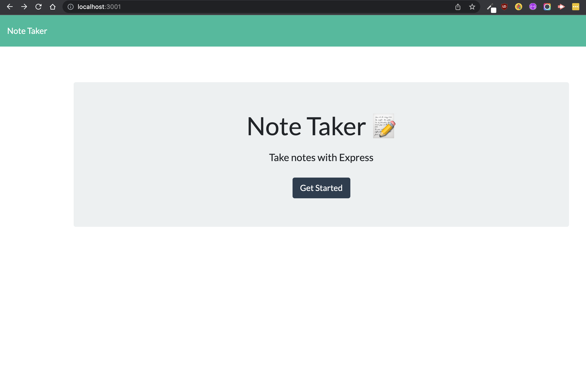
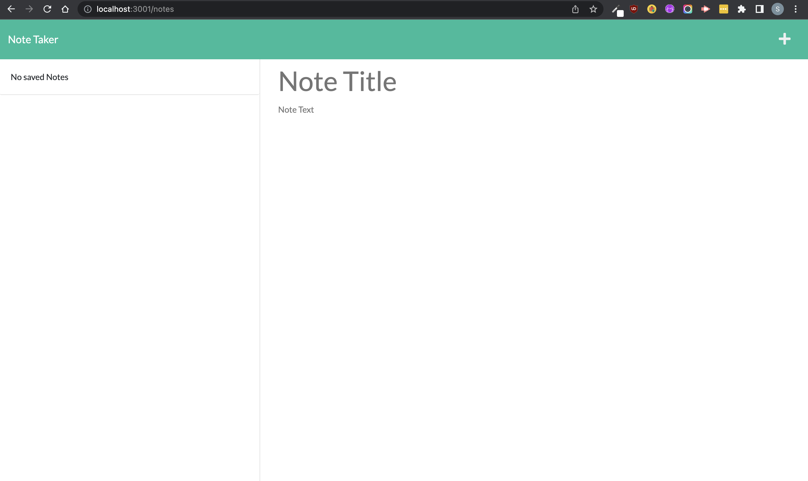
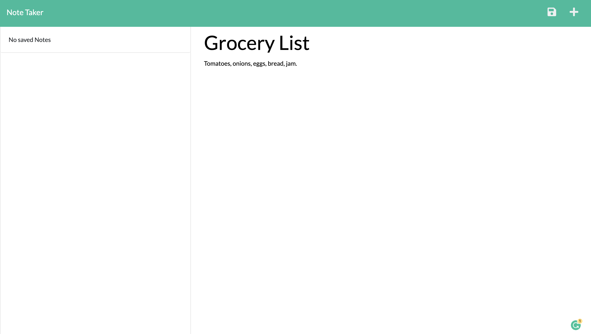
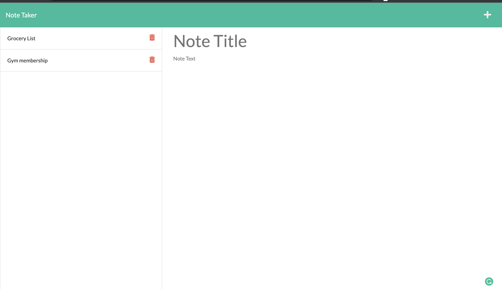

# Notes Saver

## Description

Making taking notes easier, write your notes and save to review or delete later.

## Table Of Contents

- [Description](#description)
- [Technologies Used](#technology-used)
- [Installation](#installation)
- [Usage](#usage)
- [License](#license)
- [Questions](#questions)

## Technologies Used

- HTML
- CSS
- Javascript
- Node.js
- Express

## Installation

Steps:

- clone repository
- install node
- npm i

## Usage

- To use the app click [here]()

- 

- 

- 

- 

## License

Licensed under MIT

# Questions

Reach out for any questions:

- GitHub : katochsenthal

- Email: katoch.senthal@gmail.com
